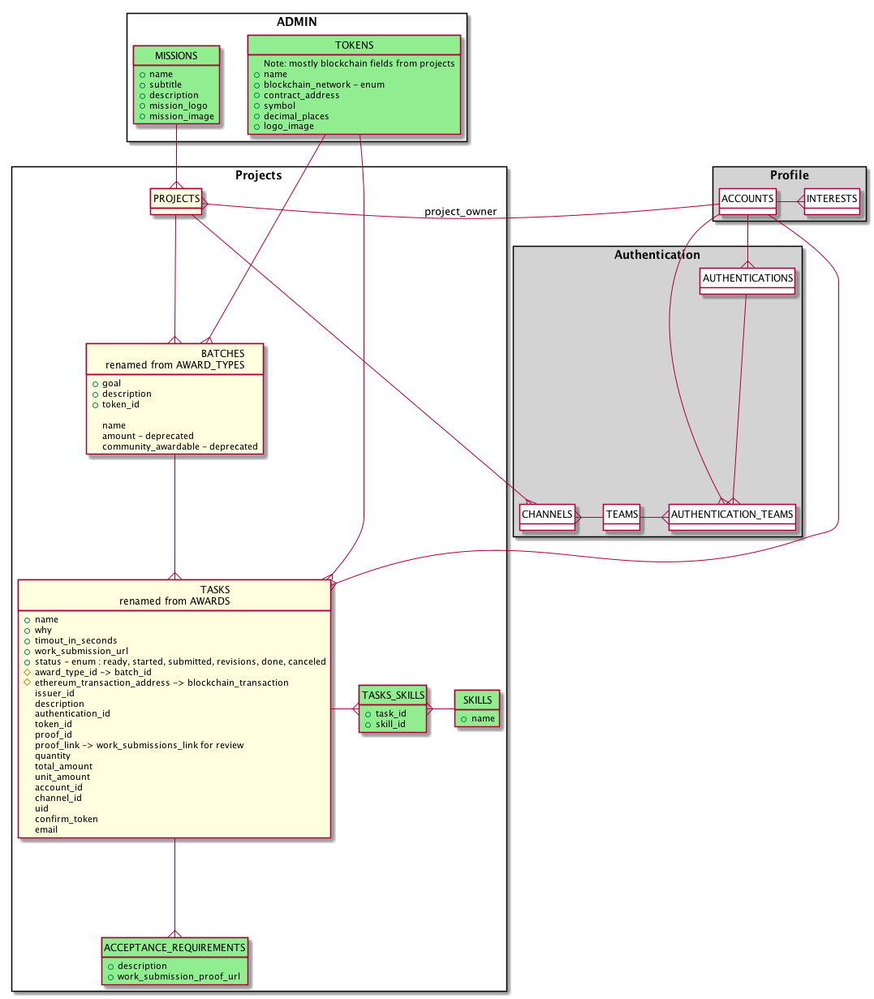

# CoMakery

CoMakery helps coordinate blockchain missions, projects, tasks and payments.


## Configuration

We use environment variables for app "secrets", and values which vary between environments,
eg staging and production.

## Local development

Prerequisites:

- PostgreSQL
- Redis (if you want to run delayed jobs)
- Bundler
- Yarn
- Chrome and Chromedriver ([Reference setup](https://github.com/CircleCI-Public/circleci-dockerfiles/blob/master/ruby/images/2.4.4-stretch/browsers/Dockerfile))

Set up .env:

```sh
cp .env.dev .env
heroku config -a <YOUR_HEROKU_APP> -s | egrep '^(SLACK_|ETHEREUM_|ETHERCAMP_)' | sort >> .env
```

Basics :

```sh
source .env
bundle install
yarn install
rails db:setup
rails data:migrate
```

Run server:

```sh
rails server
```

or if you want to run with delayed jobs:

```sh
bin/server
```
## React on Rails

###  Webpacker

For development, run `bin/webpack-dev-server` command in a terminal separate from `rails s` so that the changes made inside react components are updated real time.
However for production, we will use precompiled react code so we don't need to run webpack-dev-server for production mode.
And Webpacker hooks up a new webpacker:compile task to assets:precompile, which gets run whenever you run assets:precompile.
So after running assets precompile, all react components will be working in production mode.

### React_Rails

All react components should be inside `app/javascript/components`. 
Use the `react_component` helper to render react component with `<%= react_component "Account" %>`.

https://github.com/reactjs/react-rails

## Running tests

Faster test runs with: `bin/rspec`

More thorough test runs (integrates views): `bin/rspect`

JS tests via Jest: `yarn test`

## Code Commit and Deployment Workflow

* Develop your code locally in a git feature branch
* `bin/shipit` to git push your branch to GitHub *only if tests and quality checks pass*. This runs the same checks that CircleCI will run after you push your code to GitHub.
* On GitHub, create a pull request from your feature Branch to the `acceptance` branch
* Get your code reviewed by at least one person
* Merge your PR to `acceptance`
* Code merged to `acceptance` is automatically deployed to `demo.comakery.com` on Heroku for QA
* Once code is tested it is manually merged to `master`
* If CI passes on master, master is manually deployed to `staging.comakery.com` on Heroku
* If the code looks good on staging then it is manually deployed to `www.comakery.com` on Heroku

## Deploying to Heroku Environments

### `bin/deploy heroku-app [git-ref]`

Example usage:
```
# deploy HEAD of current branch to staging
bin/deploy comakery-staging

# deploy the git ref called hot-fix-branch to staging
bin/deploy comakery-staging hot-fix-branch

# deploy HEAD of current branch to production
bin/deploy comakery-production
```

The `bin/deploy` script does the following:
1. Turn on the down for maintenance page
2. Manually backup production
3. Deploy the git code in the current local branch to the heroku app specified
4. Run `rake db:migrate`
5. Run `rake data:migrate` to migrate data
6. Restart the apps with `heroku restart`
7. Turn off the down for maintenance page 


The old method of deploying that still can be used as a backup is:
```
citizen deploy production master comakery
```

## Data migrations

We are using the data-migrate gem to load static table data or transform data. data migrate works similarly to schema migrations - they run in sequence, are run only once, track the last database migration that was run in the database, and can be run with rake.

Data migration scripts are located in `db/data_migrations`. 

If you need to migrate data or add static table data run
```
rake data:migrate
```

To generate a new data migration run
```
rails g data_migration add_this_to_that
```

More documentation is [here](https://github.com/ilyakatz/data-migrate)


## Basic Auth

Set an environment variable called `BASIC_AUTH` in the format
`<username>:<password>` (e.g., `chewie:r0000ar`). Basic auth will be enabled if
that environment variable exists.

## Deploying to Heroku with app.json

This is useful if you want to create a new environment.

- [](https://heroku.com/deploy?template=https://github.com/CoMakery/comakery-app)
- During setup update API keys and secrets according to environment
- After deployment manually update formation and addons plans according to environment
- Re-run migrations using Heroku CLI, if `heroku-postgresql` plan is upgraded from `hobby-dev`
- Setup DNS and install following addons in case of production or staging environment:
  - https://elements.heroku.com/addons/ssl
  - https://elements.heroku.com/addons/expeditedssl
- Update Cloudfront and Airbrake settings

## Sidekiq

Visit <COMAKERY_INSTANCE>/admin/sidekiq

Username admin, password is in heroku app settings

### Clear and regenerate dead sidekiq jobs

If you are getting an out of memory error for Redis. The processed queue can take up a lot of memory. It can be cleared with `Sidekiq::Stats.new.reset`

If the queue gets backed up or the regenerate script starts duplicating jobs, you can clear it out the Sidekiq job queue by running:

```
Sidekiq::Queue.all.each(&:clear)
Sidekiq::RetrySet.new.clear
Sidekiq::ScheduledSet.new.clear
Sidekiq::Stats.new.reset
Sidekiq::DeadSet.new.clear
```

### Redis Configuration On Heroku

You can find the configuration details at the Heroku Overview Redis To Go link. Notice that this is **redis to go** and **NOT Heroku Redis**. This means that Heroku Redis commands will not work.

You might get an error like `Redis::CommandError: OOM command not allowed when used memory > 'maxmemory'.`

To remove old keys you can do the following. Use the correct environment for your needs.

```
heroku addons -a comakery-staging
```

You will see something like:
```
redistogo (redistogo-spherical-15306)          micro        $5/month   created
 └─ as REDISTOGO
```

More info with:
```
heroku addons:info redistogo-spherical-15306
```

### Flushing Redis Directly

Hopefully you won't need this...

Consider clearing out the Sidekiq Redis jobs using the `Sidekiq::Queue.all.each(&:clear)` and related Sidekiq methods as described in other sections.

You can connect to Redis To Go CLI with:
```
redis-cli -h lab.redistogo.com -p 9968 -a [password]
```

To flush the old keys
```
lab.redistogo.com:9968> flushdb
```

## Skills & Interests Schema Overview


## General Schema


