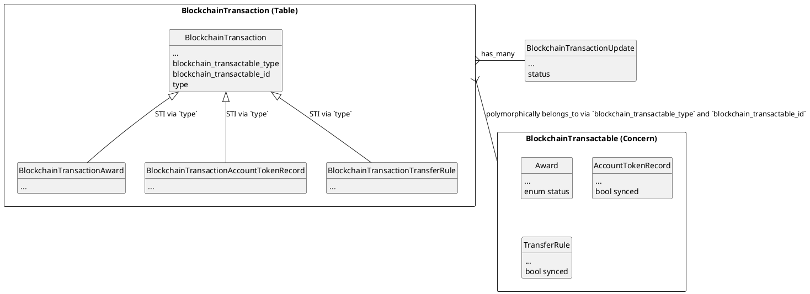

# Blockchain Transactions and Transactable

```plantuml
@startuml b-tx
hide circle
hide methods
hide stereotypes

package "BlockchainTransactable (Concern)" as BlockchainTransactable <<rectangle>> {
  class Award {
    ...
    enum status
  }
  class AccountTokenRecord {
    ...
    bool synced
  }
  class TransferRule {
    ...
    bool synced
  }
}

package "BlockchainTransaction (Table)" as BlockchainTransactionTable <<rectangle>> {
  class "BlockchainTransaction" as BlockchainTransaction <<rectangle>> {
    ...
    blockchain_transactable_type
    blockchain_transactable_id
    type
  }

  class BlockchainTransactionAward <<rectangle>> {
    ...
  }

  class BlockchainTransactionAccountTokenRecord <<rectangle>> {
    ...
  }

  class BlockchainTransactionTransferRule <<rectangle>> {
    ...
  }
}

class "BlockchainTransactionUpdate" as BlockchainTransactionUpdate <<rectangle>> {
  ...
  status
}

BlockchainTransactionTable }-down- BlockchainTransactable : polymorphically belongs_to via `blockchain_transactable_type` and `blockchain_transactable_id`
BlockchainTransactionTable }-right- BlockchainTransactionUpdate : has_many
BlockchainTransaction <|-down- BlockchainTransactionAward : STI via `type`
BlockchainTransaction <|-down- BlockchainTransactionAccountTokenRecord : STI via `type`
BlockchainTransaction <|-down- BlockchainTransactionTransferRule : STI via `type`
@enduml
```
