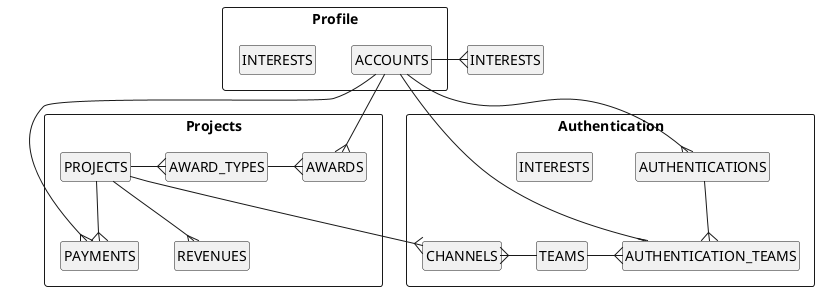

# Current

```plantuml
@startuml
hide circle
hide methods
hide attributes
hide stereotypes
package Profile <<rectangle>>{
  class ACCOUNTS
  class INTERESTS
}
package Authentication <<rectangle>> {
  class AUTHENTICATIONS
  class AUTHENTICATION_TEAMS
  class TEAMS
  class CHANNELS
  class INTERESTS
}

package Projects <<rectangle>> {
  class PROJECTS
  class AWARDS
  class AWARD_TYPES
  class PROJECTS
  class PAYMENTS
  class REVENUES
}

ACCOUNTS --{ AUTHENTICATIONS
ACCOUNTS --{ AWARDS
ACCOUNTS -{ AUTHENTICATION_TEAMS
ACCOUNTS -{ PAYMENTS
ACCOUNTS -{ INTERESTS

AUTHENTICATIONS -down-{ AUTHENTICATION_TEAMS

AWARD_TYPES -{ AWARDS

PROJECTS -{ AWARD_TYPES
PROJECTS -down-{ CHANNELS
PROJECTS -down-{ PAYMENTS
PROJECTS -down-{ REVENUES

TEAMS -{ AUTHENTICATION_TEAMS
TEAMS -left-{ CHANNELS

@enduml
```

