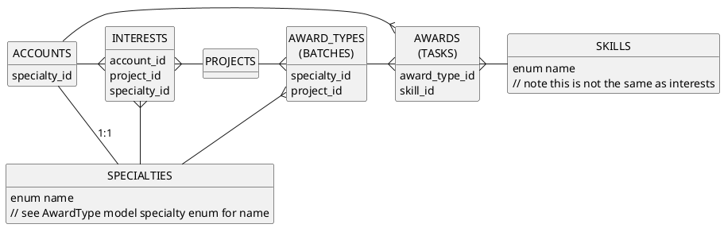
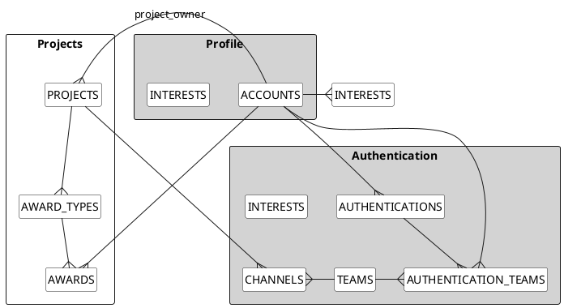
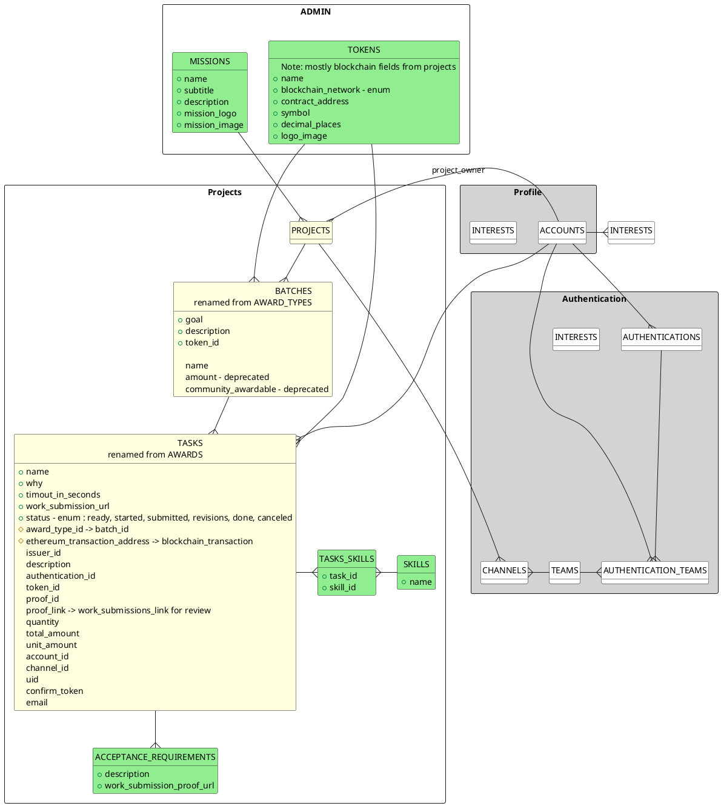

# SKILL & INTEREST SCHEMAS

```plantuml
@startuml skill-interest-schema
!define table(x) class x << (T,#FFAAAA) >>
hide circle
hide methods
hide stereotypes
  class ACCOUNTS {
    specialty_id
  }
  class INTERESTS {
    account_id
    project_id
    specialty_id
  }
  class SPECIALTIES {
    enum name
    // see AwardType model specialty enum for name
  }
  class PROJECTS {
  }
  class "AWARD_TYPES\n(BATCHES)" as BATCHES {
    specialty_id
    project_id
  }
  class "AWARDS\n(TASKS)" as TASKS {
    award_type_id
    skill_id
  }
  class SKILLS {
    enum name
    // note this is not the same as interests
  }
  ACCOUNTS -right-{ INTERESTS
  ACCOUNTS -- SPECIALTIES: 1:1
  INTERESTS }-right- PROJECTS
  PROJECTS -right-{ BATCHES
  INTERESTS }-- SPECIALTIES
  BATCHES }-- SPECIALTIES
  BATCHES -right-{ TASKS
  TASKS }- SKILLS
  ACCOUNTS -{ TASKS
@enduml
```

# Simplified Current

```plantuml
@startuml simplified-current-schema
hide circle
hide methods
hide attributes
hide stereotypes

skinparam class {
  BackGroundColor #white
}
package Profile <<rectangle>> #lightgray {
  class ACCOUNTS
  class INTERESTS
}
package Authentication <<rectangle>> #lightgray {
  class AUTHENTICATIONS
  class AUTHENTICATION_TEAMS
  class TEAMS
  class CHANNELS
  class INTERESTS
}

package Projects <<rectangle>> {
  class PROJECTS
  class AWARDS
  class AWARD_TYPES
  class PROJECTS
}

ACCOUNTS --{ AUTHENTICATIONS
ACCOUNTS -left-{ PROJECTS : project_owner
ACCOUNTS --{ AWARDS
ACCOUNTS -{ AUTHENTICATION_TEAMS
ACCOUNTS -{ INTERESTS

AUTHENTICATIONS -down-{ AUTHENTICATION_TEAMS
AWARD_TYPES -down-{ AWARDS

PROJECTS -down-{ AWARD_TYPES
PROJECTS -down-{ CHANNELS

TEAMS -{ AUTHENTICATION_TEAMS
TEAMS -left-{ CHANNELS

@enduml
```

# SCHEMA UPDATES

```plantuml
@startuml updated-schema
!define table(x) class x << (T,#FFAAAA) >>
hide circle
hide methods
hide stereotypes

skinparam class {
  BackGroundColor #white
}

package Profile <<rectangle>> #lightgray {
  class ACCOUNTS
  class INTERESTS
}
package ADMIN <<rectangle>> {
  class MISSIONS #lightgreen {
    + name
    + subtitle
    + description
    + mission_logo
    + mission_image
  }
  class TOKENS #lightgreen {
    Note: mostly blockchain fields from projects
    + name
    + blockchain_network - enum
    + contract_address
    + symbol
    + decimal_places
    + logo_image
  }
}
package Authentication <<rectangle>> #lightgray {
  class AUTHENTICATIONS
  class AUTHENTICATION_TEAMS
  class TEAMS
  class CHANNELS
  class INTERESTS
}

package Projects <<rectangle>> {
  class PROJECTS #lightyellow {
  }
  class "BATCHES\rrenamed from AWARD_TYPES" as BATCHES #lightyellow {
    + goal
    + description
    + token_id
    
    name
    amount - deprecated
    community_awardable - deprecated
  }
  class TASKS_SKILLS #lightgreen {
    + task_id
    + skill_id
  }
  class "TASKS\rrenamed from AWARDS" as TASKS #lightyellow {
    + name
    + why
    + timout_in_seconds
    + work_submission_url
    + status - enum : ready, started, submitted, revisions, done, canceled
    # award_type_id -> batch_id
    # ethereum_transaction_address -> blockchain_transaction
    issuer_id
    description
    authentication_id
    token_id
    proof_id
    proof_link -> work_submissions_link for review
    quantity
    total_amount
    unit_amount
    account_id
    channel_id
    uid
    confirm_token
    email
  }
  class SKILLS #lightgreen {
    + name
  }
  class ACCEPTANCE_REQUIREMENTS #lightgreen {
    + description
    + work_submission_proof_url
  }
}

MISSIONS -down-{ PROJECTS
TOKENS -{ TASKS
TOKENS -{ BATCHES
PROJECTS -{ CHANNELS
PROJECTS -down-{ BATCHES
BATCHES --{ TASKS
TASKS -{ TASKS_SKILLS
TASKS_SKILLS }- SKILLS
TASKS }- ACCOUNTS
TASKS --{ ACCEPTANCE_REQUIREMENTS

ACCOUNTS --{ AUTHENTICATIONS
ACCOUNTS -{ AUTHENTICATION_TEAMS
ACCOUNTS -{ INTERESTS
ACCOUNTS -{ PROJECTS : project_owner
TEAMS -{ AUTHENTICATION_TEAMS
TEAMS -left-{ CHANNELS

AUTHENTICATIONS -down-{ AUTHENTICATION_TEAMS

@enduml
```
