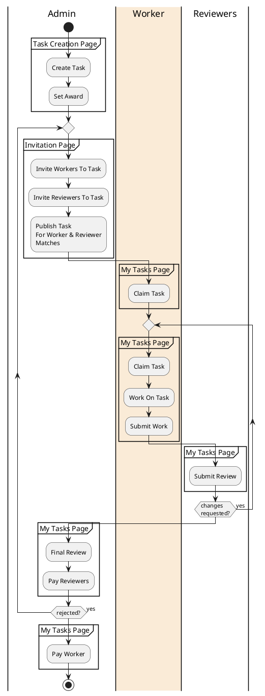
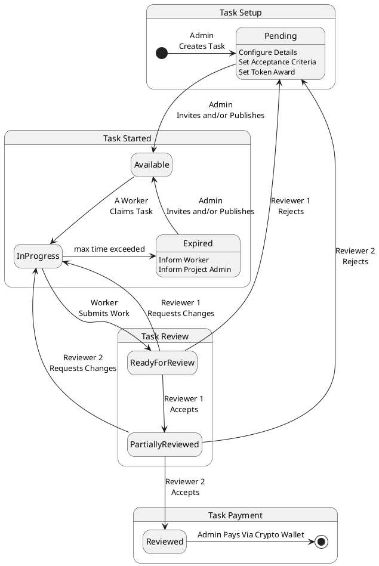

```plantuml
@startuml task-activity
|Admin|
start
partition "Task Creation Page" {
    :Create Task;
    :Set Award;
}

repeat
partition "Invitation Page" {
    :Invite Workers To Task;
    :Invite Reviewers To Task;
    :Publish Task\nFor Worker & Reviewer\nMatches;
}
partition "My Tasks Page" {
    |#AntiqueWhite|Worker|
    |Worker|
    :Claim Task;
}
    repeat
    partition "My Tasks Page" {
        |#AntiqueWhite|Worker|
        |Worker|
        :Claim Task;
        |Worker|
        :Work On Task;
        :Submit Work;
    }
    partition "My Tasks Page" {
        |Reviewers|
        :Submit Review;
    }
    repeat while (changes\nrequested?) is (yes)
    partition "My Tasks Page" {
        |Admin|
        :Final Review;
        :Pay Reviewers;
    }

repeat while (rejected?) is (yes)
partition "My Tasks Page" {
    |Admin|
    :Pay Worker;
}
stop
@enduml
```

```plantuml
@startuml task-states
hide empty description
state "Task Setup" as Setup {
    [*] -right-> Pending : Admin\nCreates Task
    Pending : Configure Details
    Pending : Set Acceptance Criteria
    Pending : Set Token Award
}
state "Task Started" as Started {
    Pending --> Available  : Admin\nInvites and/or Publishes
    Available -down-> InProgress : A Worker\nClaims Task
    InProgress -right-> Expired: max time exceeded
    Expired: Inform Worker
    Expired: Inform Project Admin
    Expired -up-> Available: Admin\nInvites and/or Publishes
}

state "Task Review" as Review {
    InProgress -down-> ReadyForReview: Worker\nSubmits Work
    ReadyForReview -up-> InProgress: Reviewer 1\nRequests Changes
    ReadyForReview --> PartiallyReviewed: Reviewer 1\nAccepts
    ReadyForReview -up-> Pending: Reviewer 1\nRejects
    PartiallyReviewed -up-> InProgress: Reviewer 2\nRequests Changes
    PartiallyReviewed -up-> Pending: Reviewer 2\nRejects
}

state "Task Payment" as Payment {
    PartiallyReviewed -down-> Reviewed: Reviewer 2\nAccepts
    Reviewed -right-> [*]: Admin Pays Via Crypto Wallet
}
@enduml
```